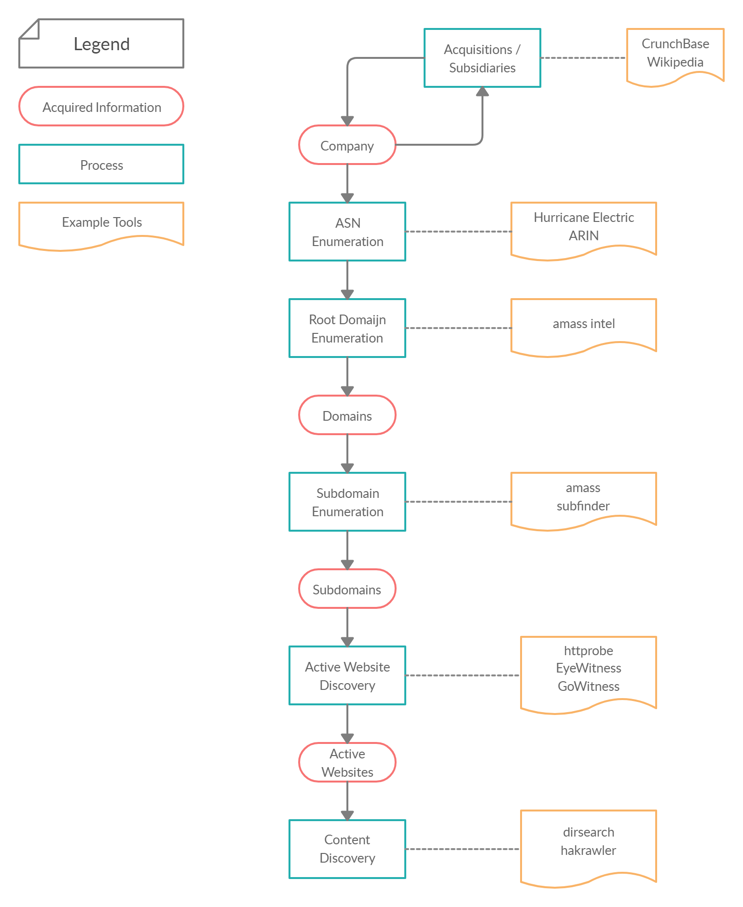

## Environment

My basic testing environment includes:
- Docker container (see [Dockerfile](Dockerfile))
- Standard config (see my [config](https://github.com/JakobRPennington/config) repo)
- BurpSuite
- Firefox
- Terminal

## Methodology

- [Choose a Program](methodology/00-choose-program.md)
- [Recon](methodology/01-recon.md)

## Bug Classes

- [SQLi](bug-classes/sqli.md)
- [XSS](bug-classes/xss.md)

## Polyglots

- [XSS](lists/polyglots/xss-polyglots.md)

## Notes

- [Environment](methodology/a-environment.md)
- [Learning](methodology/b-learn.md)
- [Jason Haddix 15 Minute Assessment](methodology/c-jhaddix-15-min-assessment.md)

## Recon Workflow

Below is a summary of my reconnaissance workflow. More details about the workflow and example commands can be found on the [recon](methodology/01-recon.md) page.

## Tips
- Create a separate Chrome profile / Google account for Bug Bounty. Create dedicated BB accounts for YouTube etc. so you can get only relevant recommended content.
- However you do it, set up an environment that has all the tools you use, all the time.
- Use aliases and bash scripts to simplify commands you use all the time.

## Resources

### Lists
- [Awesome Bug Bounty](https://github.com/djadmin/awesome-bug-bounty)

### Methodology
- [How to Shot Web: Web and mobile hacking in 2015](https://www.youtube.com/watch?v=-FAjxUOKbdI) - _Jason Haddix_
- [The Art of Subdomain Enumeration](https://github.com/appsecco/the-art-of-subdomain-enumeration) - _Appsecco_

### Tooling
- [Bug Bounty Toolkit](https://github.com/AlexisAhmed/BugBountyToolkit)
